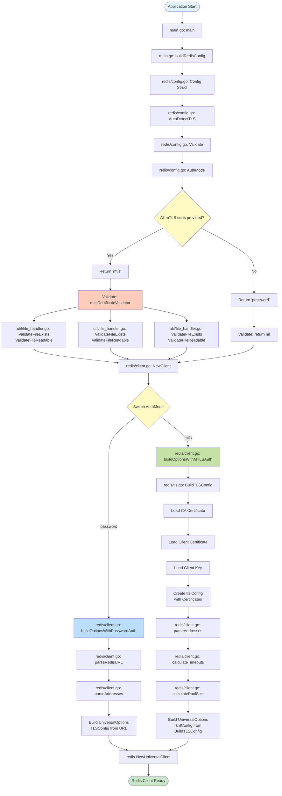

# Redis Cache Configuration

The Relay Proxy supports Redis for caching flag data. This guide covers all Redis authentication methods and setup.

## Table of Contents

1. [Authentication Methods](#authentication-methods)
2. [Password Authentication](#password-authentication)
3. [mTLS Authentication](#mtls-authentication)
4. [Certificate Generation](#certificate-generation)
5. [Configuration Reference](#configuration-reference)
6. [Architecture Overview](#architecture-overview)
7. [Helm Chart Deployment](#helm-chart-deployment)
8. [Testing](#testing)
9. [Troubleshooting](#troubleshooting)
10. [FAQs](#faqs)
11. [Security Notes](#security-notes)

---

## Authentication Methods

The Relay Proxy supports two Redis authentication methods:

1. **Password Authentication** (default) - Username/password with optional TLS encryption
2. **mTLS Authentication** - Mutual TLS with client certificates

---

## Password Authentication

Password authentication is the default method. It supports both plain and TLS-encrypted connections.

### Basic Setup

```bash
export REDIS_ADDRESS=localhost:6379
export REDIS_PASSWORD=your_password
export REDIS_USERNAME=your_username  # Optional
export REDIS_DB=0                   # Optional, default: 0
```

### With TLS Encryption (rediss://)

Using `rediss://` automatically enables TLS encryption:

```bash
export REDIS_ADDRESS=rediss://localhost:6379
export REDIS_PASSWORD=your_password
```

The `rediss://` protocol prefix automatically enables TLS encryption with server verification.

---

## mTLS Authentication

mTLS (Mutual TLS) requires client certificates for authentication. This provides the highest level of security.

### Prerequisites

1. **Redis server configured with mTLS** - Redis must be running with TLS and require client certificates
2. **CA certificate** - To verify the Redis server
3. **Client certificate** - For mTLS authentication
4. **Client private key** - For mTLS authentication

### Configuration

```bash
export REDIS_ADDRESS=rediss://localhost:6380
export REDIS_MTLS_CA_CERT=/path/to/ca.crt
export REDIS_MTLS_CLIENT_CERT=/path/to/client.crt
export REDIS_MTLS_CLIENT_KEY=/path/to/client.key

# Optional: Additional TLS settings
export REDIS_TLS_INSECURE_SKIP_VERIFY=false  # Skip server verification (testing only)
export REDIS_TLS_SERVER_NAME=localhost       # SNI server name
```

### Combined: Password + mTLS

You can use both password and mTLS together if your Redis requires both:

```bash
export REDIS_ADDRESS=rediss://localhost:6380
export REDIS_USERNAME=myuser
export REDIS_PASSWORD=mypassword
export REDIS_MTLS_CA_CERT=/path/to/ca.crt
export REDIS_MTLS_CLIENT_CERT=/path/to/client.crt
export REDIS_MTLS_CLIENT_KEY=/path/to/client.key
```

---

## Certificate Generation

For local testing, you can generate self-signed certificates using OpenSSL.

### Quick Setup Script

```bash
# Generate all certificates automatically
./setup-mtls-testing.sh
```

This creates:
- `./certs/redis/ca.crt` - CA certificate
- `./certs/redis/ca.key` - CA private key
- `./certs/redis/server.crt` - Redis server certificate
- `./certs/redis/server.key` - Redis server private key
- `./certs/redis/client.crt` - Client certificate (for mTLS)
- `./certs/redis/client.key` - Client private key (for mTLS)

### Manual Certificate Generation

If you prefer to generate certificates manually:

```bash
# Create certificates directory
mkdir -p ./certs/redis
cd ./certs/redis

# 1. Generate CA private key
openssl genrsa -out ca.key 2048

# 2. Generate CA certificate
openssl req -new -x509 -days 365 -key ca.key -out ca.crt \
    -subj "/C=US/ST=State/L=City/O=Test/CN=Redis-CA"

# 3. Generate server private key
openssl genrsa -out server.key 2048

# 4. Generate server certificate signing request
openssl req -new -key server.key -out server.csr \
    -subj "/C=US/ST=State/L=City/O=Test/CN=localhost"

# 5. Generate server certificate (signed by CA)
openssl x509 -req -days 365 -in server.csr -CA ca.crt -CAkey ca.key \
    -CAcreateserial -out server.crt \
    -extensions v3_req -extfile <(echo "[v3_req]"; echo "subjectAltName=IP:127.0.0.1,DNS:localhost")

# 6. Generate client private key (for mTLS)
openssl genrsa -out client.key 2048

# 7. Generate client certificate signing request
openssl req -new -key client.key -out client.csr \
    -subj "/C=US/ST=State/L=City/O=Test/CN=ff-proxy-client"

# 8. Generate client certificate (signed by CA)
openssl x509 -req -days 365 -in client.csr -CA ca.crt -CAkey ca.key \
    -CAcreateserial -out client.crt

# 9. Clean up temporary files
rm server.csr client.csr ca.srl
```

### Certificate File Requirements

- **Format**: All certificates must be in PEM format
- **Permissions**: Private keys (`.key` files) should have restricted permissions (600)
- **Paths**: Use absolute paths or paths relative to the working directory

---

## Setting Up Redis with mTLS (Local Testing)

For local testing, you need a Redis instance configured with TLS and mTLS.

### Option 1: Using Docker Compose (Recommended)

A Docker Compose file is provided for local testing:

```bash
# Start Redis with TLS/mTLS
docker-compose -f docker-compose.redis-tls.yml up -d redis-tls
```

This starts Redis on port `6380` with TLS enabled and requires client certificates.

### Option 2: Using Local Redis

If you have Redis installed locally, create `redis-tls.conf`:

```conf
port 0
tls-port 6380
tls-cert-file /path/to/certs/redis/server.crt
tls-key-file /path/to/certs/redis/server.key
tls-ca-cert-file /path/to/certs/redis/ca.crt
tls-auth-clients yes
tls-protocols "TLSv1.2 TLSv1.3"
```

Start Redis:
```bash
redis-server redis-tls.conf
```

### Verify Redis TLS is Running

```bash
# Using Docker
docker exec ff-proxy-redis-tls redis-cli --tls \
  --cert /certs/client.crt \
  --key /certs/client.key \
  --cacert /certs/ca.crt \
  -p 6380 ping
```

Expected: `PONG`

---

## Configuration Reference

### Environment Variables

| Variable | Flag | Description | Default | Required |
|----------|------|-------------|---------|----------|
| `REDIS_ADDRESS` | `redis-address` | Redis host:port address | - | Yes |
| `REDIS_USERNAME` | `redis-username` | Redis username (ACL) | - | No |
| `REDIS_PASSWORD` | `redis-password` | Redis password | - | No |
| `REDIS_DB` | `redis-db` | Database number | 0 | No |
| `REDIS_MTLS_CA_CERT` | `redis-mtls-ca-cert` | Path to CA certificate | "" | Yes (if mTLS) |
| `REDIS_MTLS_CLIENT_CERT` | `redis-mtls-client-cert` | Path to client certificate | "" | Yes (if mTLS) |
| `REDIS_MTLS_CLIENT_KEY` | `redis-mtls-client-key` | Path to client private key | "" | Yes (if mTLS) |
| `REDIS_TLS_INSECURE_SKIP_VERIFY` | `redis-tls-insecure-skip-verify` | Skip server verification | false | No |
| `REDIS_TLS_SERVER_NAME` | `redis-tls-server-name` | SNI server name | "" | No |

### Certificate Path Configuration

**Important Notes:**
- **Mount Path is Configurable**: The default mount path is `/etc/redis/tls`, but this can be customized
- **Path Construction**: Certificate paths are constructed as `mountPath + "/" + secretKey`
- **Example**: If `mountPath="/etc/redis/tls"` and `secretKey="ca.crt"`, the full path is `/etc/redis/tls/ca.crt`
- **Override**: You can override the mount path if needed (e.g., for custom security policies)

### Connection Pool Settings

| Variable | Flag | Description | Default |
|----------|------|-------------|---------|
| `REDIS_POOL_SIZE` | `redis-pool-size` | Pool size multiplier (× CPU cores) | 10 |
| `REDIS_POOL_SIZE_LITERAL` | `redis-pool-size-literal` | Fixed pool size (overrides multiplier) | 0 |
| `REDIS_DIAL_TIMEOUT_SECONDS` | `redis-dial-timeout-seconds` | Connection timeout | 5 |
| `REDIS_READ_TIMEOUT_SECONDS` | `redis-read-timeout-seconds` | Read timeout | 3 |
| `REDIS_WRITE_TIMEOUT_SECONDS` | `redis-write-timeout-seconds` | Write timeout | 3 |
| `REDIS_POOL_TIMEOUT_SECONDS` | `redis-pool-timeout-seconds` | Pool timeout | 4 |

See [Configuration](./configuration.md) for complete list of options.

---

## Architecture Overview

### Redis Initialization Flow

The following diagram illustrates how Redis client initialization works with different authentication methods:



### Authentication Detection Logic

The `AuthMode()` function determines authentication type:

- **Default**: Always returns `"password"` (backward compatible)
- **mTLS**: Automatically enabled when all three certificate paths are provided (CA cert, client cert, client key)
- **TLS via URL**: `rediss://` protocol auto-enables TLS encryption but uses password auth (not mTLS)

### File Structure

```
cmd/ff-proxy/
  └── main.go
      └── buildRedisConfig() → redis.Config

redis/
  ├── config.go
  │   ├── Config struct
  │   ├── AuthMode() → "password" | "mtls"
  │   ├── AutoDetectTLS()
  │   └── Validate()
  │
  ├── client.go
  │   ├── NewClient()
  │   ├── buildOptionsWithPasswordAuth()
  │   └── buildOptionsWithMTLSAuth()
  │
  └── tls.go
      └── BuildTLSConfig() → *tls.Config

util/
  └── file_handler.go
      ├── ValidateFileExists()
      └── ValidateFileReadable()
```

---

## Helm Chart Deployment

### Overview

The Helm chart supports Redis mTLS authentication through Kubernetes Secrets. TLS is **disabled by default** and must be explicitly enabled by clients.

### Prerequisites

1. **Kubernetes Secret** containing Redis TLS certificates
2. **Helm chart** with Redis TLS configuration enabled
3. **Certificates** in PEM format (CA, client cert, client key)

### Creating the Kubernetes Secret

```bash
# Create secret with certificates
kubectl create secret generic redis-tls-secret \
  --from-file=ca.crt=/path/to/ca.crt \
  --from-file=client.crt=/path/to/client.crt \
  --from-file=client.key=/path/to/client.key \
  -n <namespace>
```

### Enabling Redis mTLS in Helm

#### Option 1: Using `--set` Flags

```bash
helm upgrade -i ff-proxy --namespace ff-proxy . \
  --set proxyKey=xxxx-xxx-xxx-xxxx \
  --set authSecret=xxxx-xxx-xxx-xxxx \
  --set redis.address=rediss://redis.example.com:6380 \
  --set redis.tls.enabled=true \
  --set redis.tls.mode=mtls \
  --set redis.tls.secret.name=redis-tls-secret
```

#### Option 2: Using Custom Values File

Create `my-values.yaml`:

```yaml
redis:
  address: "rediss://redis.example.com:6380"
  tls:
    enabled: true
    mode: "mtls"
    secret:
      name: "redis-tls-secret"
      caCert: "ca.crt"
      clientCert: "client.crt"
      clientKey: "client.key"
    mountPath: "/etc/redis/tls"  # Default, can be overridden
    insecureSkipVerify: false
    serverName: ""  # Optional SNI
```

Deploy:
```bash
helm upgrade -i ff-proxy --namespace ff-proxy . -f my-values.yaml
```

#### Option 3: Custom Mount Path

If you need a custom mount path:

```yaml
redis:
  address: "rediss://redis.example.com:6380"
  tls:
    enabled: true
    secret:
      name: "redis-tls-secret"
    mountPath: "/custom/certs"  # Override default /etc/redis/tls
```

**Note**: Certificate paths are automatically constructed as `mountPath + "/" + secretKey`.

### Configuration Options

| Field | Type | Default | Description |
|-------|------|---------|-------------|
| `redis.tls.enabled` | bool | `false` | Enable TLS/mTLS (opt-in) |
| `redis.tls.mode` | string | `"mtls"` | TLS mode (only "mtls" supported) |
| `redis.tls.secret.name` | string | `""` | Kubernetes secret name (required if enabled) |
| `redis.tls.secret.caCert` | string | `"ca.crt"` | Secret key for CA certificate |
| `redis.tls.secret.clientCert` | string | `"client.crt"` | Secret key for client certificate |
| `redis.tls.secret.clientKey` | string | `"client.key"` | Secret key for client private key |
| `redis.tls.mountPath` | string | `"/etc/redis/tls"` | Mount path for certificates (configurable) |
| `redis.tls.insecureSkipVerify` | bool | `false` | Skip server verification (testing only) |
| `redis.tls.serverName` | string | `""` | SNI server name (optional) |

### How It Works

1. **Secret Mounting**: When `redis.tls.enabled: true`, the Helm chart:
   - Mounts the Kubernetes Secret as a volume at `redis.tls.mountPath`
   - Sets environment variables with certificate file paths
   - Constructs paths as `mountPath + "/" + secretKey`

2. **Environment Variables**: The chart sets:
   - `REDIS_MTLS_CA_CERT=/etc/redis/tls/ca.crt` (or custom path)
   - `REDIS_MTLS_CLIENT_CERT=/etc/redis/tls/client.crt`
   - `REDIS_MTLS_CLIENT_KEY=/etc/redis/tls/client.key`

3. **Application**: The application reads certificates from the mounted paths and establishes mTLS connection.

### Backward Compatibility

- **Default Behavior**: `redis.tls.enabled: false` (TLS disabled)
- **Existing Deployments**: Continue working without any changes
- **No Action Required**: Clients who don't need TLS don't need to do anything
- **Opt-in**: Only clients who need mTLS must explicitly enable it

### Verification

After deployment, verify TLS configuration:

```bash
# Check environment variables
kubectl exec -n <namespace> <pod-name> -- env | grep REDIS_TLS

# Check mounted certificates
kubectl exec -n <namespace> <pod-name> -- ls -la /etc/redis/tls

# Check logs for authentication mode
kubectl logs -n <namespace> <pod-name> | grep "connecting to redis"
```

**Expected Logs:**
```
INFO connecting to redis address=rediss://redis.example.com:6380 db=0 authMode=mtls tlsEnabled=true poolSize=20
```

### Troubleshooting Helm Deployments

#### Issue: Pod fails to start with certificate errors

**Symptoms**: Pod crashes with errors about missing certificates

**Solutions**:
1. Verify secret exists: `kubectl get secret redis-tls-secret -n <namespace>`
2. Verify secret contains required keys: `kubectl describe secret redis-tls-secret -n <namespace>`
3. Check secret key names match `values.yaml` configuration
4. Verify certificates are base64-encoded in secret

#### Issue: Environment variables not set

**Symptoms**: Application doesn't detect TLS configuration

**Solutions**:
1. Verify `redis.tls.enabled: true` in values.yaml
2. Check deployment template has conditional blocks
3. Verify environment variables in pod: `kubectl exec <pod> -- env | grep REDIS_TLS`
4. Check Helm template rendering: `helm template . --debug`

#### Issue: Certificates not mounted

**Symptoms**: Certificate files not found at expected paths

**Solutions**:
1. Verify volume mount exists: `kubectl describe pod <pod-name> | grep -A 5 "Mounts"`
2. Check volume definition references correct secret
3. Verify mount path matches environment variable paths
4. Check secret key names match mount path construction

---

## Testing

### Test Password Authentication

```bash
export REDIS_ADDRESS=localhost:6379
export REDIS_PASSWORD=your_password
export AUTH_SECRET="dummy-secret"
export PROXY_KEY="dummy-key"
export BYPASS_AUTH=true
export OFFLINE=true

./ff-proxy
```

**Expected Logs:**
```
INFO connecting to redis address=localhost:6379 db=0 authMode=password tlsEnabled=false poolSize=20
```

### Test Password + TLS (rediss://)

```bash
export REDIS_ADDRESS=rediss://localhost:6379
export REDIS_PASSWORD=your_password
export AUTH_SECRET="dummy-secret"
export PROXY_KEY="dummy-key"
export BYPASS_AUTH=true
export OFFLINE=true

./ff-proxy
```

**Expected Logs:**
```
INFO connecting to redis address=rediss://localhost:6379 db=0 authMode=password tlsEnabled=true poolSize=20
```

### Test mTLS Authentication

```bash
# 1. Generate certificates (if not done)
./setup-mtls-testing.sh

# 2. Start Redis with TLS (if not running)
docker-compose -f docker-compose.redis-tls.yml up -d redis-tls

# 3. Configure and run proxy
export REDIS_ADDRESS=rediss://localhost:6380
export REDIS_MTLS_CA_CERT=./certs/redis/ca.crt
export REDIS_MTLS_CLIENT_CERT=./certs/redis/client.crt
export REDIS_MTLS_CLIENT_KEY=./certs/redis/client.key
export AUTH_SECRET="dummy-secret"
export PROXY_KEY="dummy-key"
export BYPASS_AUTH=true
export OFFLINE=true

./ff-proxy
```

**Expected Logs:**
```
INFO connecting to redis address=rediss://localhost:6380 db=0 authMode=mtls poolSize=20
```

### Verify Connection

Check the health endpoint:

```bash
curl http://localhost:8000/health
```

**Expected Response:**
```json
{
  "cacheStatus": "healthy",
  ...
}
```

---

## Troubleshooting

### Certificate File Not Found

**Error:**
```
failed to read CA certificate: open ./certs/redis/ca.crt: no such file or directory
```

**Solution:**
- Verify certificate file paths are correct
- Use absolute paths if relative paths don't work
- Check file permissions (certificates should be readable)

### Certificate Validation Failed

**Error:**
```
certificate verify failed
```

**Solution:**
- Ensure CA certificate matches the one used by Redis server
- Check certificate expiration dates
- Verify certificate format (must be PEM)

### Client Certificate Not Accepted

**Error:**
```
handshake failure
```

**Solution:**
- Verify `tls-auth-clients yes` is set in Redis configuration
- Ensure client certificate is signed by the same CA as server
- Check Redis logs for authentication errors

### Connection Refused

**Error:**
```
dial tcp [::1]:6380: connect: connection refused
```

**Solution:**
- Verify Redis is running: `docker ps | grep redis-tls`
- Check Redis is listening on correct port
- Verify firewall/network settings

### Invalid TLS Mode

**Error:**
```
invalid TLS mode: tls (only 'mtls' is supported)
```

**Solution:**
- mTLS is automatically enabled when all three certificate paths are provided
- Use `rediss://` protocol for basic TLS with password auth (not mTLS)
- Provide all three certificate paths for mTLS: `REDIS_MTLS_CA_CERT`, `REDIS_MTLS_CLIENT_CERT`, `REDIS_MTLS_CLIENT_KEY`

---

## FAQs

### Can I connect to Elasticache Redis?

Yes. The Relay Proxy can connect to AWS ElastiCache Redis instances as long as cluster mode is disabled.

### What happens if network connection is lost?

If connection is lost to Harness servers, the Relay Proxy will continue to serve cached values to connected SDKs. It will attempt to reconnect and sync the latest data once connection is restored.

### What happens if changes are made on SaaS while connection is lost?

Once connection is reestablished with SaaS, all flag data is pulled down again. Any changes made on SaaS (e.g., flag toggles) during the outage will be picked up once connection is restored.

### What happens if no network connection is available on startup?

If the Relay Proxy has previously stored flag data in Redis, it will startup successfully using the cached data and serve connected SDKs. This essentially launches the Relay Proxy in offline mode.

### Can I use both password and mTLS together?

Yes. If your Redis requires both password authentication and mTLS, you can configure both:
- Set `REDIS_PASSWORD` and `REDIS_USERNAME`
- Provide all three mTLS certificate paths: `REDIS_MTLS_CA_CERT`, `REDIS_MTLS_CLIENT_CERT`, `REDIS_MTLS_CLIENT_KEY`

---

## Security Notes

⚠️ **Important Security Considerations:**

- Self-signed certificates are for **testing only**
- Use proper CA-signed certificates in production
- Keep private keys (`.key` files) secure
- Never commit certificates or private keys to version control
- Use appropriate file permissions (600 for private keys)
- Rotate certificates regularly in production

---

## Additional Resources

- [Configuration Guide](./configuration.md) - Complete configuration reference
- [Testing Guide](./testing_guide.md) - Comprehensive testing instructions
- [Helm Chart README](../charts/ff-proxy/README.md) - Helm deployment guide
